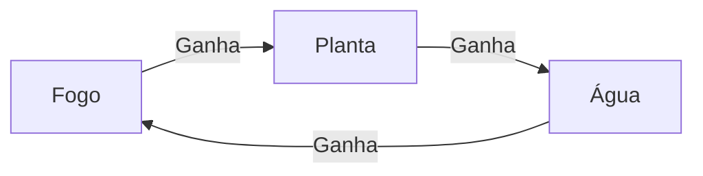

# 🐍 Aula 2: Estruturas de Seleção - Dando um "Cérebro" ao Código

> [!abstract] Missão de Hoje
> Hoje vamos aprender a ensinar o Python a tomar decisões sozinho! Vamos criar caminhos diferentes no nosso código usando `if`, `elif`, `else` e o poderoso `match case`, transformando programas estáticos em sistemas inteligentes que reagem às nossas escolhas.

---
## 🚦 1. O que é Lógica de Decisão?
Na aula passada, nossos códigos eram como uma linha reta: o computador executava o passo 1, depois o 2, depois o 3 e acabava. Mas a vida (e os jogos) não é assim! 

- No **Minecraft**, *SE* você cair na lava, *ENTÃO* você toma dano. 
- No **Pokémon**, *SE* o HP chegar a 0, *ENTÃO* o Pokémon desmaia.

Programar é criar esses "E SE". Usamos **Estruturas de Seleção (Decisão)** para dizer ao computador qual caminho seguir.

---
## ⚖️ 2. Operadores de Comparação (A Balança)
Para decidir, o computador precisa comparar coisas. O resultado de uma comparação é sempre um Booleano: **True** (Verdadeiro) ou **False** (Falso).

| Operador | Significado    | Exemplo           |
| :------- | :------------- | :---------------- |
| `==`     | Igual a        | `10 == 10` (True) |
| `!=`     | Diferente de   | `10 != 5` (True)  |
| `>`      | Maior que      | `5 > 10` (False)  |
| `<`      | Menor que      | `3 < 8` (True)    |
| `>=`     | Maior ou igual | `10 >= 10` (True) |
| `<=`     | Menor ou igual | `5 <= 2` (False)  |


> [!danger] ⚠️ CUIDADO:
> Em Python, `=` serve para **guardar** algo na caixa (atribuição). Nós lemos esse símbolo como "Recebe". 
> 
> Para **comparar** se dois valores são iguais, usamos `==` (dois sinais de igual).

---
## 🏗️ 3. O Comando `if` e a Regra do Espaço (Indentação)
O `if` (tradução: "SE") é o comando básico. 

```python
vida: int = 5

if vida <= 0:
	# O código está dentro do if, por isso o espaço (TAB)
    print("Game Over! 😵")
```

### 📏 A Regra de Ouro: Indentação
Percebeu o espaço antes do `print`? Em Python, esse espaço (geralmente a tecla **TAB** ou 4 espaços) é **obrigatório**. Ele avisa ao Python que aquele comando só deve ser executado se o `if` for verdadeiro. É como se fosse o "conteúdo" da decisão.

---

## 🛣️ 4. `else` e `elif`: E se não for?
E se quisermos um caminho alternativo?
* **`else` (SENÃO):** O que acontece se a condição do `if` for falsa.
* **`elif` (SENÃO SE):** Usado quando temos várias opções (é a abreviação de `else if`).

```python
# Exemplo: Verificador de Bioma do Minecraft
bioma: str = input("Em qual bioma você está? ").lower()

if bioma == "deserto":
    print("Cuidado com a sede e com os huskies! 🏜️")
elif bioma == "floresta":
    print("Corte madeira, mas cuidado com as aranhas! 🌲")
elif bioma == "neve":
    print("Pegue neve para fazer bonecos! ❄️")
else:
    print("Bioma desconhecido... Explore com cuidado! 🌎")
```

---
## 🖇️ 5. Encadeando Operações:
Às vezes, uma condição só não basta. Precisamos de várias!
### Operadores Lógicos (and, or)
Quando apenas queremos juntar 2 ou mais condições, podemos utilizar os operadores lógicos:
* **`and` (E):** Só é verdade se as DUAS coisas forem verdadeiras.
    * *Ex:* Você só entra no server SE tiver o **IP** `and` tiver na **Whitelist**.
* **`or` (OU):** É verdade se PELO MENOS UMA for verdadeira.
    * *Ex:* Você foge do monstro SE usar uma **Poção de Invisibilidade** `or` tiver uma **Elytra**.

![[Tabela Verdade - Bob Esponja.png]]

```python
tem_chave: bool = True
nivel_jogador: int = 15

if tem_chave == True and nivel_jogador >= 10:
    print("Porta da Dungeon aberta! 🚪🔑")
else:
    print("Você ainda não pode entrar...")
```

### Condições Alinhadas
Quando uma decisão depende da anterior, podemos utilizar um IF dentro de outro. Imagine minerar no Minecraft:

```python
camada: int = int(input("Em qual camada (Y) você está? "))
tem_picareta_ferro: bool = True

if camada <= 16:
    print("Você está na zona de Diamantes! 💎")
    if tem_picareta_ferro:
        print("Pode minerar! Você ganhou um diamante.")
    else:
        print("Você achou o diamante, mas ele quebrou porque você não tinha picareta de ferro! 😭")
else:
    print("Continue cavando para baixo...")
```

---
## 🏛️ Match Case
Temos um jeito mais limpo de escolher entre várias opções específicas. Imagine que você está criando um menu de seleção de classe:

```python
classe: str = input("Escolha sua classe (Guerreiro, Mago, Arqueiro): ").capitalize()

match classe:
    case "Guerreiro":
        print("Você recebeu uma Espada e um Escudo! 🛡️")
    case "Mago":
        print("Você recebeu um Cajado de Fogo! 🔥")
    case "Arqueiro":
        print("Você recebeu um Arco e 64 flechas! 🏹")
    case _:
        print("Classe inválida. Você começa como um Aldeão! 👨‍🌾")
```

> [!info] O símbolo `_` (underline) funciona como o "caso padrão" (else), se nenhuma das opções acima for escolhida.

---
# 🛠️ Desafios em Sala

## 1. Escolha seu Inicial
No início da sua jornada, o Professor Carvalho permite que você escolha seu primeiro Pokémon. No entanto, seu rival é estratégico e sempre escolhe o tipo que tem vantagem sobre o seu.



Crie um algoritmo que receba a sua escolha e exiba a mensagem correspondente à decisão do rival, conforme a tabela de tipos clássica.

| Entrada | Saída                       |
| :------ | :-------------------------- |
| Fogo    | Seu rival escolherá Água!   |
| Água    | Seu rival escolherá Planta! |
| Planta  | Seu rival escolherá Fogo!   |

```python
# Solução:

```

## 2. Sistema de Dano de Queda:
No Minecraft, você começa a tomar dano de queda se cair de uma altura maior que 3 blocos. Peça a altura da queda e diga se o jogador sobreviveu (considerando que ele tem 20 de vida e cada bloco acima de 3 tira 1 de vida).

| Entrada | Saída                                  |
| :------ | :------------------------------------- |
| 2       | Você pousou em segurança!              |
| 10      | Você sobreviveu, mas perdeu 7 de vida! |
| 25      | Game Over! A queda foi muito alta.     |

```python
# Solução:

```

## 3. Alerta de Durabilidade
Crie um sistema que pede o nome de uma ferramenta e sua durabilidade (0 a 100). 
- Se for "Picareta" e durabilidade < 10: "Cuidado! Sua picareta vai quebrar!"
- Se for "Espada" e durabilidade < 5: "Sua espada está cega!"
- Para outros casos ou ferramentas novas: "Ferramenta em bom estado."

```python
# Solução:

```

---
# 💪 Exercícios de Casa
## 1. Teste de Mesa
Imagine que você é o processador do computador. Preencha a tabela de saída para o código abaixo:

```python
nivel = int(input())
tem_insignia = input() # 'Sim' ou 'Não'

if nivel >= 50 or tem_insignia == "Sim":
    if nivel < 100:
        print("Pode enfrentar a Elite dos 4!")
    else:
        print("Você é um Campeão Pokémon!")
else:
    print("Continue treinando...")
```

| Entrada (Nível) | Entrada (Insígnia) | Saída Esperada (O que aparece na tela?) |
| :-------------- | :----------------- | :-------------------------------------- |
| 30              | Não                |                                         |
| 55              | Não                |                                         |
| 120             | Sim                |                                         |
| 10              | Sim                |                                         |
## 2. Detetive de Código
O código abaixo deveria verificar se um jogador de Minecraft pode entrar no "The End", mas ele está cheio de erros (sintaxe e lógica). **Encontre e circule os 3 erros principais:**

```python
olhos_do_fim = 12
tem_picareta = True

if olhos_do_fim = 12 and tem_picareta == True
print("Portal Ativado!")
else
    print("Faltam itens...")
```

**Escreva aqui quais são os erros que você encontrou:**
1. 
2. 
3. 
## 3. O Separador de Itens (Par ou Ímpar)
Adapte o exercício clássico de par/ímpar: O jogador tem uma máquina que separa blocos. Se o número de blocos for **PAR**, eles vão para o baú da **Esquerda**. Se for **ÍMPAR**, vão para a **Direita**.

| Entrada | Saída                     |
| :------ | :------------------------ |
| 10      | Baú da Esquerda (PAR)     |
| 7       | Baú da Direita (ÍMPAR)    |
## 4. A Loja da Vila (Menu de Opções)
Crie um menu para um Villager vendedor:
1. Pão (1 Esmeralda)
2. Espada de Ferro (7 Esmeraldas)
3. Maçã Dourada (10 Esmeraldas)

Peça para o usuário digitar o número do item e quanto ele tem de dinheiro. Diga se a compra foi autorizada ou se "Faltam esmeraldas!".

| Entrada | Saída              |
| :------ | :----------------- |
| 2<br>10 | Compra autorizada! |
| 3<br>5  | Faltam esmeraldas! |

## 5. Triângulo de Crafting
Leia três valores (A, B, C) e verifique se eles podem formar um triângulo.
- **Dica:** Se a soma de dois lados sempre maior que o terceiro, forma triangulo.

Se puderem, diga se o triângulo é:
- **Equilátero:** Todos os lados iguais.
- **Isósceles:** Dois lados iguais.
- **Escaleno:** Todos os lados diferentes.

| Entrada      | Saída                |
| :----------- | :------------------- |
| 5, 5, 5      | Triângulo Equilátero |
| 3, 4, 5      | Triângulo Escaleno   |
| 1, 1, 10     | Não forma triângulo! |

## 6. Classificador de Nível de Treinador
Peça o XP total de um treinador e classifique-o:
- Menos de 1000: **Novato**
- Entre 1001 e 5000: **Explorador**
- Entre 5001 e 10000: **Mestre**
- Acima de 10000: **Lenda Viva**

| Entrada | Saída       |
| :------ | :---------- |
| 500     | Novato      |
| 7500    | Mestre      |
## 7. Calculadora de Batalha
Peça a vida de um pokemon, o dano de um ataque (int) e se o ataque foi "Super Efetivo" (S), "Normal" (N) ou "Não muito efetivo" (R).
- Se S: Dano dobrado.
- Se N: Dano normal.
- Se R: Metade do dano.

Faça um algoritmo que preveja se o pokemon permanece de pé:

| Entrada       | Saída                              |
| :------------ | :--------------------------------- |
| 15<br>10<br>S | Dano Final: 20<br>Pokemon Desmaiou |
| 10<br>10<br>R | Dano Final: 5<br>Pokemon Continua  |
