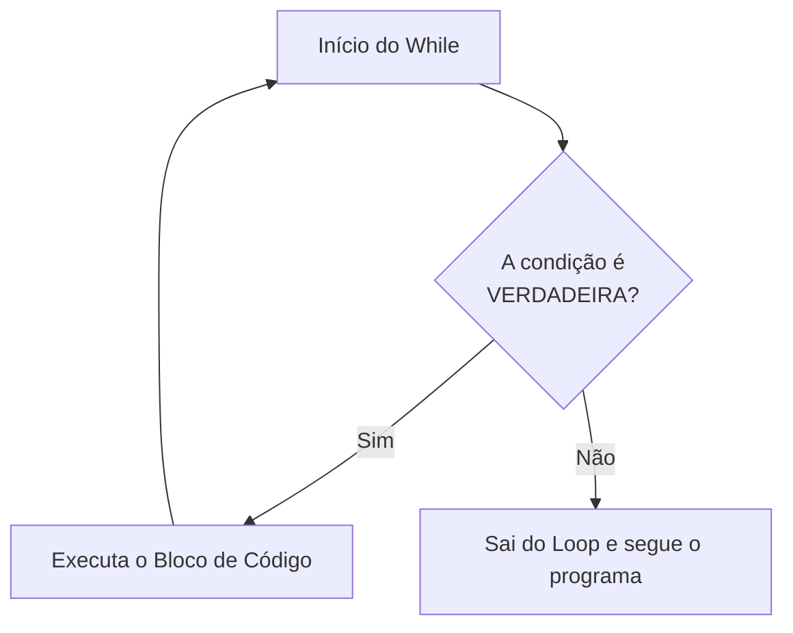
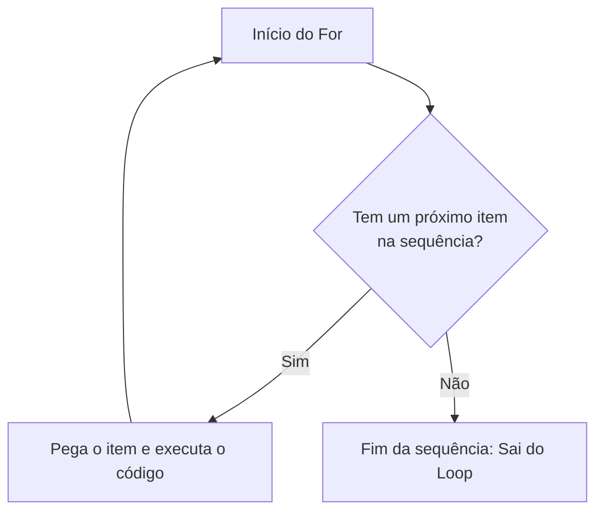
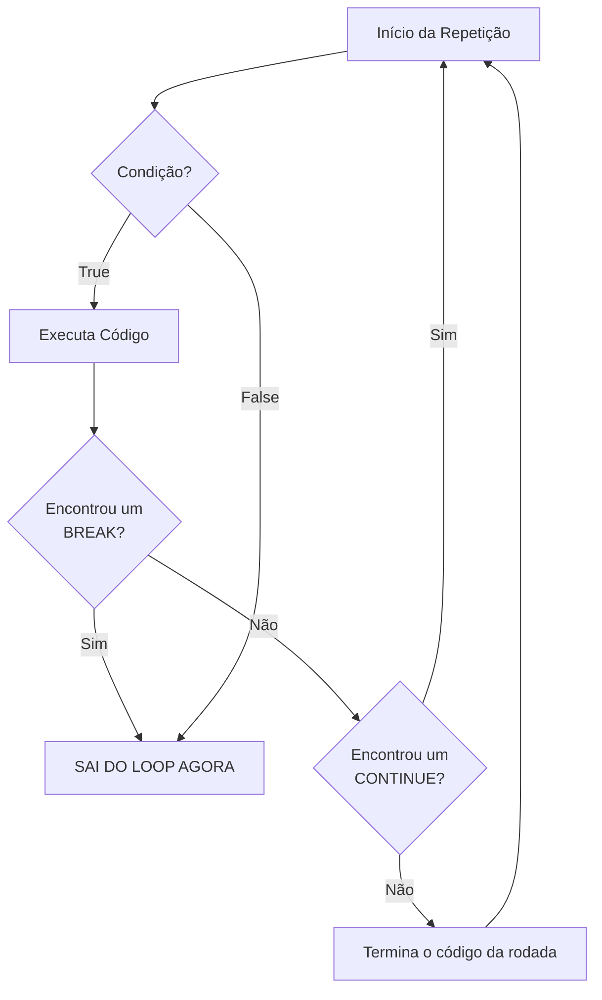
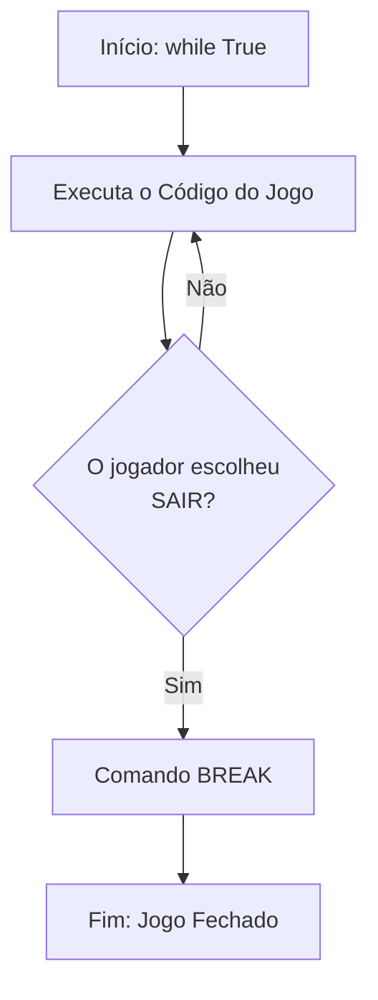

# 🐍 Aula 3: Estruturas de Repetição - O Poder da Automação

> [!abstract] Missão de Hoje
> Hoje vamos descobrir como fazer o Python trabalhar por nós! Em vez de escrever a mesma linha 100 vezes, vamos aprender a criar "laços" (loops) de repetição. Vamos dominar o `while` e o `for`, transformando comandos simples em processos automáticos e poderosos.

---
## 🔄 1. Por que repetir?
Imagine que você quer que seu personagem no Minecraft cave um buraco de 50 blocos para baixo. Você prefere digitar o comando de cavar 50 vezes ou dizer: "Enquanto não chegar na camada 5, continue cavando"?

Estruturas de repetição (ou **Loops**) servem para executar um bloco de código várias vezes sem que a gente precise reescrevê-lo.

---
## 🔁 2. O Comando `while` (Enquanto...)
O `while` é o loop baseado numa **condição**. Ele vai repetir tudo o que estiver "dentro" dele (indentado) enquanto a condição for **True**.



**Analogia:** É como um despertador com a função "Soneca". *Enquanto* você não apertar o botão de parar, ele continua tocando.

```python
energia: int = 5

while energia > 0:
    print(f"O mineiro cavou um bloco! Energia restante: {energia}")
    energia -= 1  # Se não diminuir, o loop é infinito!

print("O mineiro cansou e foi dormir. 😴")
```

> [!danger] ⚠️ O PERIGO DO LOOP INFINITO
> Se a condição do `while` nunca se tornar falsa, o programa vai rodar para sempre até o computador travar! Sempre verifique se algo dentro do loop muda a condição (como o `energia = energia - 1` acima).

---
## 🔢 3. O Comando `for` (Para cada...)
O `for` é usado quando sabemos (ou queremos definir) exatamente quantas vezes algo deve acontecer ou quando queremos percorrer uma lista de itens.



Em Python, o `for` trabalha muito bem com a função `range()`. O `range(start, stop, step)` é como um mapa:
- **start:** Onde começa. Se omitir, é 0.
- **stop:** Onde para (ele não inclui esse número!).
- **step:** De quanto em quanto ele pula (pode ser negativo para contar para trás). Se omitir, é 1.

```python
print("Contagem regressiva para o lançamento do foguete:")
for i in range(5, 0, -1):
    print(i)
print("Decolar! 🚀")
```

---
## 🛑 4. Break e Continue: Comandos de Emergência
Às vezes, precisamos sair de um loop antes da hora ou pular uma etapa.
- **`break`:** Interrompe o loop imediatamente. (Achei o diamante, pode parar de cavar!)
- **`continue`:** Pula o resto do código desta rodada e vai direto para a próxima repetição. (Este bloco é cascalho, pula ele!)



```python
for andar in range(1, 11):
    if andar == 5:
        print("Pulei o andar 5, dizem que dá azar! 👻")
        continue
    print(f"Limpando o andar {andar}...")
```

### ♾️ O "Loop Infinito" Controlado (While True)
Às vezes, queremos que o programa rode para sempre até que o usuário decida parar (como o menu de um jogo). Para isso, usamos o `while True`.

```python
while True:
    comando: str = input("Digite 'sair' para fechar o jogo ou 'jogar' para continuar: ")
    if comando == "sair":
        print("Fechando o jogo...")
        break # O comando break "parte" o loop imediatamente!
    print("A iniciar nova partida! 🎮")
```




> [!tip] **Curiosidade Técnica:**
> Em linguagens como C, existe o `do-while`. O `while True` com um `if/break` no final é a forma como o Python faz algo parecido, garantindo que o código rode pelo menos uma vez.

### 🎁 O comando `Loop Else`
O Python tem um truque que poucas linguagens têm: o `else` no final do loop. Ele só é executado se o loop terminar **normalmente** (sem ser interrompido por um `break`).

```python
for tentativa in range(1, 4):
    print(f"Tentativa {tentativa}: Procurando na área...")
    achou: str = input("Achou um Pikachu? (s/n): ")
    if achou == "s":
        print("Parabéns! Capturou o Pikachu! ⚡")
        break
else:
    print("O Pikachu fugiu para outra zona... 😢")
```

> [!tip] **Controverso:**
> Alguns programadores dizem que essa sintaxe não é boa para leitura e pode causar confusões. Além disso, não é algo tão comum de se utilizar, porém, vale a pena conhecer.

---
## 🕸️ 5. Loops Alinhados
Imagine que quer construir uma parede de blocos no Minecraft. Tem de percorrer a **Altura** e, para cada nível de altura, percorrer a **Largura**.

```python
largura: int = 5
altura: int = 3

for h in range(altura):
    for l in range(largura):
        print("🧱", end="") # O end="" faz não saltar linha
    print() # Salta linha quando acaba a largura
```


---
# 🛠️ Desafios em Sala

## 1. Batalha de Turnos
Um Pokémon selvagem apareceu com 50 de vida! Crie um loop que pergunte quanto de dano seu ataque deu. O programa deve subtrair o dano e mostrar a vida restante até que o Pokémon desmaie (vida <= 0).

| Entrada                        | Saída                                                                                                     |
| :----------------------------- | :-------------------------------------------------------------------------------------------------------- |
| 12<br>12<br>12<br>12<br>1<br>5 | Vida atual: 38<br>Vida atual: 26<br>Vida atual: 14<br>Vida atual: 2<br>Vida atual: 1<br>Pokémon desmaiou! |

```python
# Solução:

```

## 2. Tabuada Dinâmica
Peça um número e mostre a tabuada dele de 1 a 10 usando um loop.

| Entrada | Saída                                            |
| :------ | :----------------------------------------------- |
| 7       | 7 x 1 = 7<br>7 x 2 = 14<br> ... <br> 7 x 10 = 70 |

```python
# Solução:

```

## 3. Pinheiro de Natal do Minecraft
O jogador quer decorar a casa. Crie um programa que receba a **altura** da árvore e desenhe a copa usando `#`. No final, adicione sempre um tronco centralizado.

| Entrada | Saída                                                                              |
| :------ | :--------------------------------------------------------------------------------- |
| 3       | &nbsp;&nbsp;#&nbsp;&nbsp;<br>&nbsp;###&nbsp;<br>#####<br>&nbsp;&nbsp;#&nbsp;&nbsp; |

```python
# Solução:

```

---

# 💪 Exercícios de Casa

## 1. Teste de Mesa
O que será impresso na tela ao executar este código?

```python
soma: int = 0
for x in range(1, 6):
    if x % 2 == 0:
        soma += x
print(soma)
```

**Resposta:** 

## 2. Detetive de Código
O código abaixo deveria contar de 0 a 10, mas algo está errado. Encontre os 3 erros e corrija:

```python
i: int = 0
while i < 10:
print(f"Número {i}")
```

Simplifique o código utilizando for:
```python
# Solução: 

```

## 3. O Baú de Itens Infinito
Crie um programa que peça nomes de itens para colocar no baú. O programa deve continuar pedindo até que o usuário digite "sair". No final, diga quantos itens foram adicionados.

| Entrada                             | Saída                        |
| :---------------------------------- | :--------------------------- |
| Espada<br>Picareta<br>Tocha<br>sair | Você guardou 3 itens no baú! |
## 4. Gerador de XP
Um Pokémon ganha XP em 5 batalhas. Use um `for` para ler os 5 valores. Calcule o total. A cada 50 pontos, ele sobe de nível. Diga o XP total e quantos níveis ele subiu.

| Entrada                   | Saída                                                                                   |
| :------------------------ | :-------------------------------------------------------------------------------------- |
| 10<br>20<br>5<br>35<br>31 | Pokemon subiu de nível.<br>Pokemon subiu de nível.<br><br>Total: 101 pontos \| 2 níveis |

## 5. O Scanner de Minérios
Uma atualização fez que diamantes só surgissem em camadas que são números primos. Peça um número e use um loop para contar quantos divisores ele tem. Se tiver apenas 2 (1 e ele mesmo), é **PRIMO**!

| Entrada | Saída                            |
| :------ | :------------------------------- |
| 2       | A camada 2 possui diamantes!     |
| 7       | A camada 7 possui diamantes!     |
| 8       | A camada 8 não possui diamantes! |

## 6. O Alquimista de Poções
Para criar uma Poção de Super Força, você precisa realizar misturas sucessivas. Se o nível da poção é 5, você deve multiplicar: 5 x 4 x 3 x 2 x 1. Crie um programa que receba o nível da poção e calcule o "Poder Total" (Fatorial).

| Entrada | Saída               |
| :------ | :------------------ |
| 4       | Poder da Poção: 24  |
| 5       | Poder da Poção: 120 |
## 7. Senha do Servidor
Você está tentando entrar em um servidor privado de Minecraft. O sistema permite apenas **3 tentativas** de senha. Se o usuário acertar a senha ("python123"), exiba "Acesso Liberado! 🔓". Se as tentativas acabarem, exiba "Conta Bloqueada! ❌".

| Entrada (Exemplo)               | Saída                                    |
| :------------------------------ | :--------------------------------------- |
| erro<br>errado<br>python123     | Acesso Liberado! 🔓                      |
| um<br>dois<br>tres              | Tentativas esgotadas. Conta Bloqueada! ❌ |
